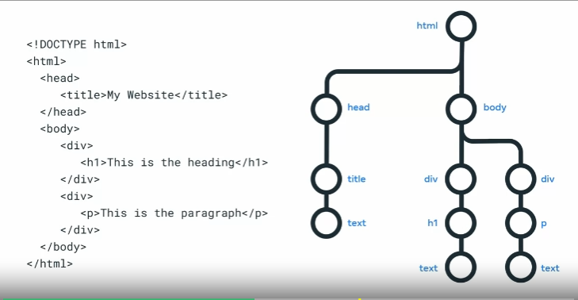

# Introduction to Front-End Development

- This repos contains all of my assignments from the Coursera Course: [Introduction to Front-End Development](https://www.coursera.org/learn/introduction-to-front-end-development?specialization=meta-front-end-developer)

### Notes:
__DOM__ - Document Object Model: The DOM is a tree-like structure that models the HTML document. It is used to interact with the HTML document using JavaScript.
